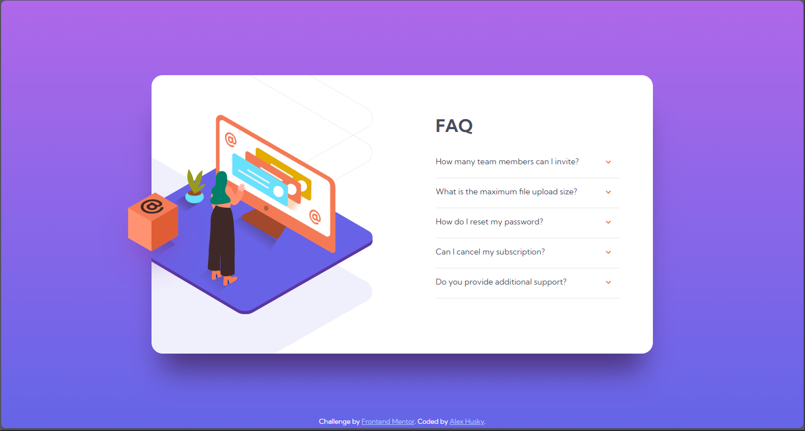

# Frontend Mentor - FAQ accordion card solution

This is a solution to the [FAQ accordion card challenge on Frontend Mentor](https://www.frontendmentor.io/challenges/faq-accordion-card-XlyjD0Oam). Frontend Mentor challenges help you improve your coding skills by building realistic projects.

## Table of contents

- [Overview](#overview)
  - [The challenge](#the-challenge)
  - [Screenshot](#screenshot)
  - [Links](#links)
- [My process](#my-process)
  - [Built with](#built-with)
  - [What I learned](#what-i-learned)
  - [Continued development](#continued-development)
  - [Useful resources](#useful-resources)
- [Author](#author)
- [Acknowledgments](#acknowledgments)

**Note: Delete this note and update the table of contents based on what sections you keep.**

## Overview

### The challenge

Users should be able to:

- View the optimal layout for the component depending on their device's screen size
- See hover states for all interactive elements on the page
- Hide/Show the answer to a question when the question is clicked

### Screenshot

### Links

- Solution URL: [Add solution URL here](https://github.com/ashusky92/faq-accordion-card)
- Live Site URL: [Add live site URL here](https://ashusky92.github.io/faq-accordion-card/)

## My process

### Built with

- Semantic HTML5 markup
- SCSS
- Flexbox
- Some CSS grid
- Mobile-first workflow

### What I learned

I learned that whitespace can magically appear outside of the HTML when you use margin (?). I replaced the margin with padding and it got rid of it.

### Continued development

I plan to keep working on getting my styles closer to the provided designs. I think I did pretty good this time, but I'm sure there is plenty to improve on.

## Author

- Website - [Alex Husky](https://www.alexhusky.com)
- Frontend Mentor - [@ashusky92](https://www.frontendmentor.io/profile/ashusky92)
